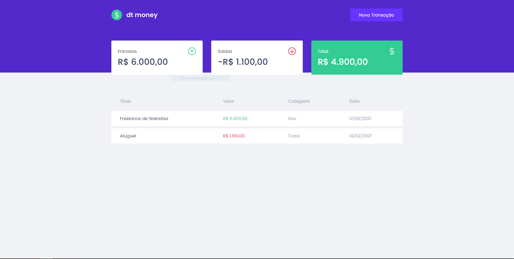

# dtmoney

# Sobre a Aplicação
## Simular Back-End
para simular um Back-End utilizamos a Ferramenta  `MirageJS` \
para armazenar e persistir os dados e apresentalos na tela após cadastralos

## Criação da interface
Para ser criada cada parte da interface utilizamos duas ferramentas importantes \
a principal delas é o `ReactJs` para fazer a componentização e o estudo de hooks \
tanto de estado, efeito e de contexto./

Para a estilização utilizamos o `styled-components` para criarmos uma interface agradavel e responsiva.

### Comando para instalar as Dependencias e executala em seu computador.
Pare executar em sua máquina e instalar os as libs\
necessárias utilize o comando `< yarn install >`

## Como executa-la
para iniciar a aplicação utilize o comando `yarn start`